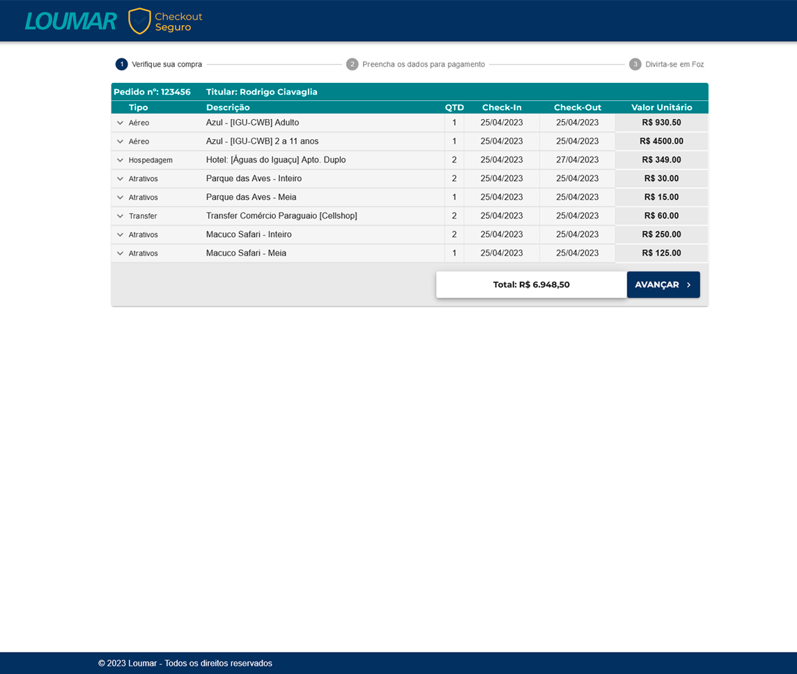
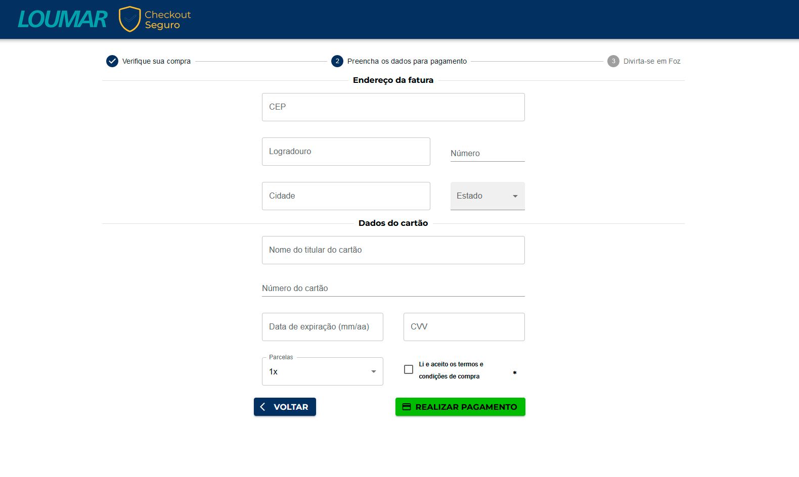
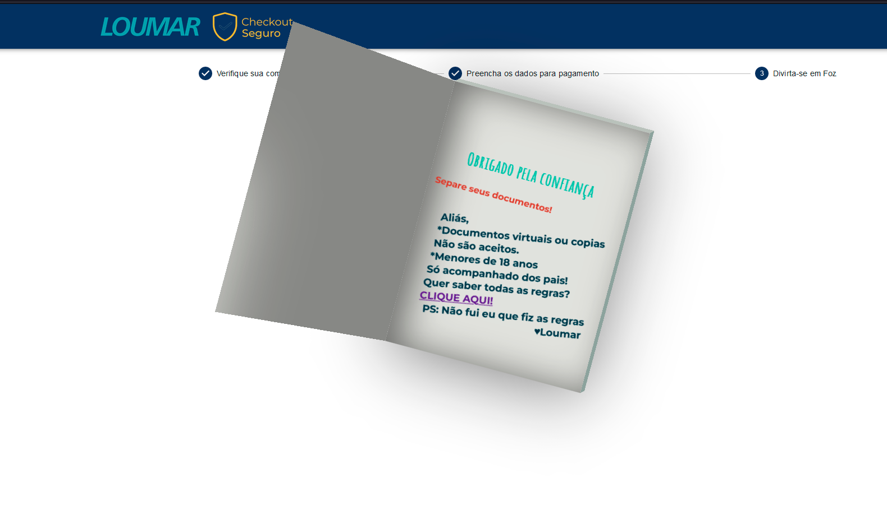

# Página de Checkout em três passos

## Descrição
Realizado para a empresa Loumar Turismo, desenvolvido em ReactJS, um checkout de três passos, onde o usuário verifica o pedido no primeiro passo, e no segundo passo efetua a compra preenchendo os dados pessoais e do cartão de credito e no terceiro uma mensagem de agradecimento e boas vindas.

## Instalação
Para instalar as dependências do projeto, execute
```bash
npm install
```
ou
```bash
yarn install
```

## Execução
Para executar o projeto, execute
```bash
npm run dev
```
ou
```bash
yarn dev
```
### dependências

```bash
    "@emotion/react": "^11.10.6",
    "@emotion/styled": "^11.10.6",
    "@mui/icons-material": "^5.11.16",
    "@mui/material": "^5.12.1",
    "axios": "^1.3.6",
    "date-fns": "^2.29.3",
    "formik": "^2.2.9",
    "inputmask": "^5.0.8",
    "react": "^18.2.0",
    "react-dom": "^18.2.0",
    "react-input-mask": "^2.0.4",
    "yup": "^1.1.1"
```

## Features
- [x] Página de checkout em três passos
- [x] Validação de campos
- [x] Máscaras de campos
- [x] Consumo de API ViaCep
- [x] Preenchimento automatico do endereço
- [x] Responsividade para mobile
- [] Consumo de API de pagamento


## Imagens
<!-- ./step1.png -->

### Primeira etapa do checkout

### Segunda etapa do checkout

### Terceira etapa do checkout



### Autor
---
<a href="https://www.linkedin.com/in/erikhpo/">
 
 <br />
 <sub><b>Erik Henrique (ErikHPO)</b></sub></a> <a href="https://www.linkedin.com/in/erikhpo" title="linkedin">🚀</a>